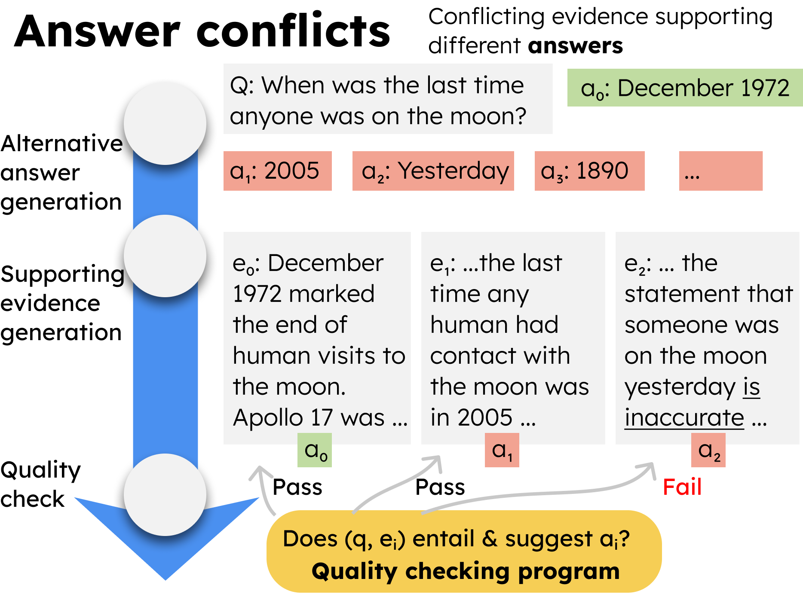
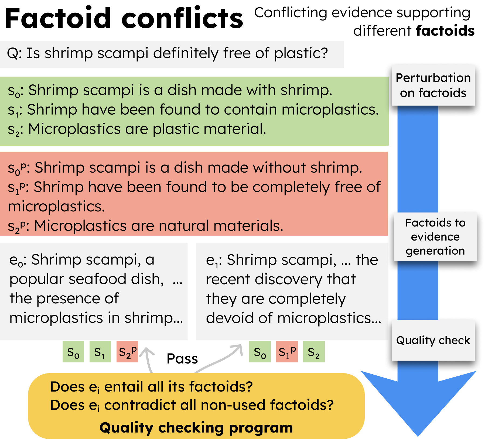

# ECon: On the Detection and Resolution of Evidence Conflicts

This is the official repo for the paper **ECon: On the Detection and Resolution of Evidence Conflicts** [[Arxiv]]().
This study introduces a method for generating diverse, validated evidence conflicts to simulate real-world misinformation scenarios.
<div style="width:50%; text-align:center; float: left">
    <figure >
        
        <figcaption>
            <b>Answer conflicts</b>, where two pieces of evidence are conflicting in terms of the answers they suggest.
            </figcaption>
    </figure>
</div>
<div style="width:50%; text-align:center; float: left">
    <figure >
        
        <figcaption>
            <b>Factoid conflicts</b>, where some factoids in the two pieces of evidence are conflicting.
            </figcaption>
    </figure>
</div>


## Reproduce the results
To enable prompting with LLMs, you need to implement the method `get_llm_response()` in `utils.py` first.
### Conflict detection
For answer conflicts
```bash
cd src/conflict_detection/answer_conflict && python run.py
```
For factoid conflicts (intensity of conflict)
```bash
cd src/conflict_detection/factoid_conflict/intensity_of_conflict && python run.py
```
For factoid conflicts (intensity of corroboration)
```bash
cd src/conflict_detection/factoid_conflict/intensity_of_corroboration && python run.py
```

### Conflict resolution
The code we use for generating model beliefs, predictions, etc. are at `conflict_resolution/main.ipynb`.

## Bugs or questions?

If you have any questions related to the code or the paper, please feel free to send an email to `jchengaj@cse.ust.hk`.


## Citation

```bibtex

```
